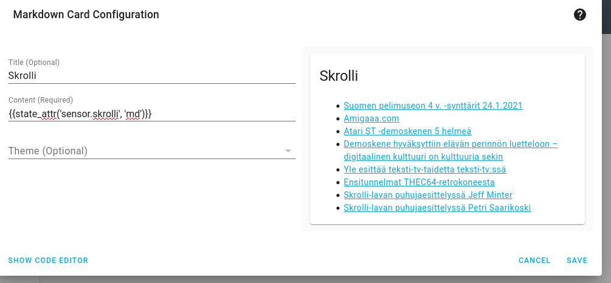

⬆️ For table of contents, click the above icon


[](https://github.com/joonas-fi/rss-to-homeassistant/releases)

Pushes RSS feeds into Home Assistant as Markdown, so they can be displayed natively.

For more background, see my [blog post](https://joonas.fi/2020/08/displaying-rss-feed-with-home-assistant/).


Prerequisites
-------------

- Home Assistant
- Home Assistant needs to be connected to a MQTT server
- This software


Configuration
-------------

You need to create `config.json`:

```json
{
	"mqtt": {
		"address": "127.0.0.1:1883",
		"credentials": {
			"username": "AzureDiamond",
			"password": "hunter2"
		}
	},
	"rss_feeds": [
		{
			"id": "skrolli",
			"url": "https://skrolli.fi/feed/",
			"poll_interval": "15m"
		}
	]
}
```

### Polling Interval Configuration

You can configure the polling interval for each RSS feed individually using the `poll_interval` parameter. The interval should be specified as a string in Go's duration format (e.g., "30s", "5m", "1h").

- **Default**: If not specified, the default polling interval is 1 minute ("1m")
- **Minimum**: 10 seconds ("10s")
- **Maximum**: 24 hours ("24h")

Example configuration with different intervals:

```json
{
	"rss_feeds": [
		{
			"id": "news",
			"url": "https://example.com/feed.xml",
			"poll_interval": "5m"  // Check every 5 minutes
		},
		{
			"id": "blog",
			"url": "https://blog.example.com/rss",
			"poll_interval": "30m"  // Check every 30 minutes
		}
	]
}
```

If you don't use MQTT username/password, you can remove the whole `"credentials": {...}` section.


How to use
----------

You can run this on any computer as long as it can connect to the same MQTT server that Home Assistant uses.

For example, make a directory `/home/<username>/rss-to-homeassistant`.

Download a suitable binary there (for Raspberry Pi, use the ARM build, for PCs use the amd64 build).

You can rename the downloaded binary to `rss-to-homeassistant`.

You've created the configuration file. The directory has these contents:

```
/home/pi/rss-to-homeassistant
├── config.json
└── rss-to-homeassistant
```

Test starting it manually. If everything goes well, you should see this message:

```console
$ ./rss-to-homeassistant
2021/03/22 07:45:30 [INFO] skrolli changed
```

You can stop it with `Ctrl + c`.

The RSS feed should've just popped into Home Assistant (because we use its
[autodiscovery](https://www.home-assistant.io/docs/mqtt/discovery/) mechanism to advertise the feeds):


This means that Home Assistant has the Markdown content of the RSS feed. We're close to the finish line.


Displaying the feed's Markdown content
--------------------------------------

You need to add a Markdown card, with content that has a dynamic placeholder to display the feed
entity's Markdown content:



You're done!


Keep this running across system restarts
----------------------------------------

If you're on Linux, we have a helper to integrate with systemd:

```console
./rss-to-homeassistant install-as-service
Wrote unit file to /etc/systemd/system/rss-to-homeassistant.service
Run to enable on boot & to start (--)now:
	$ systemctl enable --now rss-to-homeassistant
Verify successful start:
	$ systemctl status rss-to-homeassistant
```

If you followed the tips the installer gave, this program should automatically start after reboots.
Have fun! Enjoy life.


TODO
----

- Implement HTTP caching to be nice to RSS publishers
- Add more configuration options for feed display
